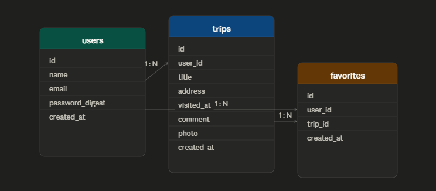

# どこいったっけ？

## アプリの概要
旅行の記録を残せるWebアプリです。訪れた場所の住所を入力するだけでGoogle Mapsに自動表示されます。

## アプリのURL
https://trip-app-doko-itta.onrender.com

## 使い方
1. ゲストログインまたは新規登録してログイン
2. 「新しい記録を投稿」から旅行記録を追加
3. 住所を入力するとGoogle Mapsで地図が自動表示
4. キーワード検索・お気に入りで記録を絞り込み

## 機能一覧
- ユーザー登録・ログイン・ゲストログイン
- 旅行記録のCRUD（投稿・一覧・詳細・編集・削除）
- 写真アップロード
- Google Maps連携（住所→地図自動表示）
- キーワード検索
- お気に入り機能
- 自分の投稿フィルター

## 使用技術
- Ruby 3.3.6
- Ruby on Rails 8.1.3
- PostgreSQL
- Bootstrap 5
- Google Maps API
- Geocoder
- Active Storage
- Render（デプロイ）

## ER図

## なぜこれを作ったか
「あの場所どこだったっけ？」という経験から、旅行記録を地図と一緒に残せるアプリを作りました。

## 工夫したところ
- 住所を入力するだけでGoogle Mapsに自動ピン表示
- ゲストログイン機能で採用担当様がすぐ試せる設計
